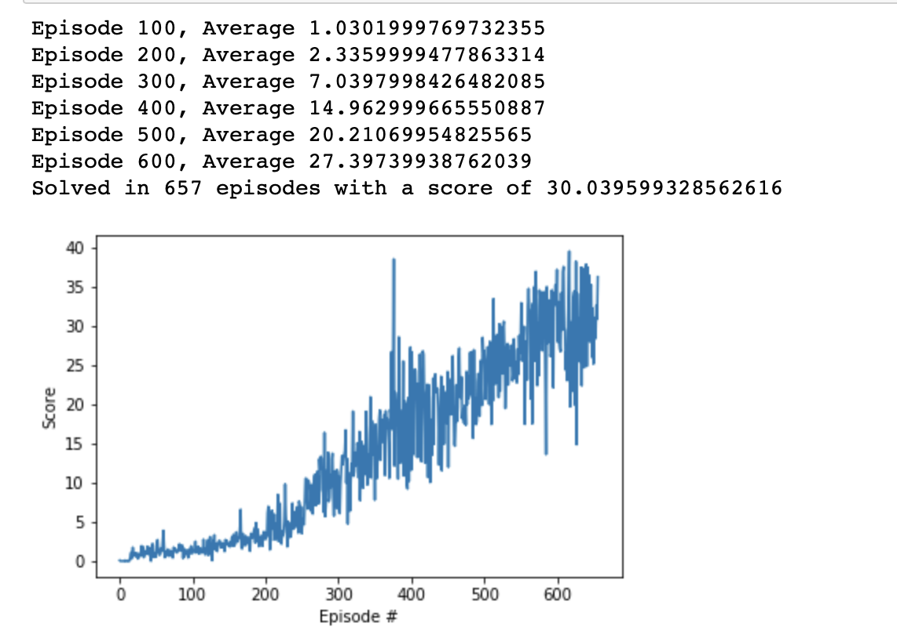

# Report

## Learning Algorithm

Algorithm used:
Deep Deterministic Policy Gradients (DDPG)

Network used:
Actor Critic with two hidden layers
```
hidden_layers = [128, 64]
```

Hyperperameters used:

```
max_memory = 100000
batch_size = 128
learning_rate = 0.0001
tau = 0.001
gamma = 0.99
update_every = 4
```

## Plot of Rewards

`checkpoint.pth` has a score of 30.



## Ideas for Future Work

The hyperparameters can be adjusted a bit more to improve the Agent score.
More agents can also be added to train simultaniously to solve the environment even quicker.